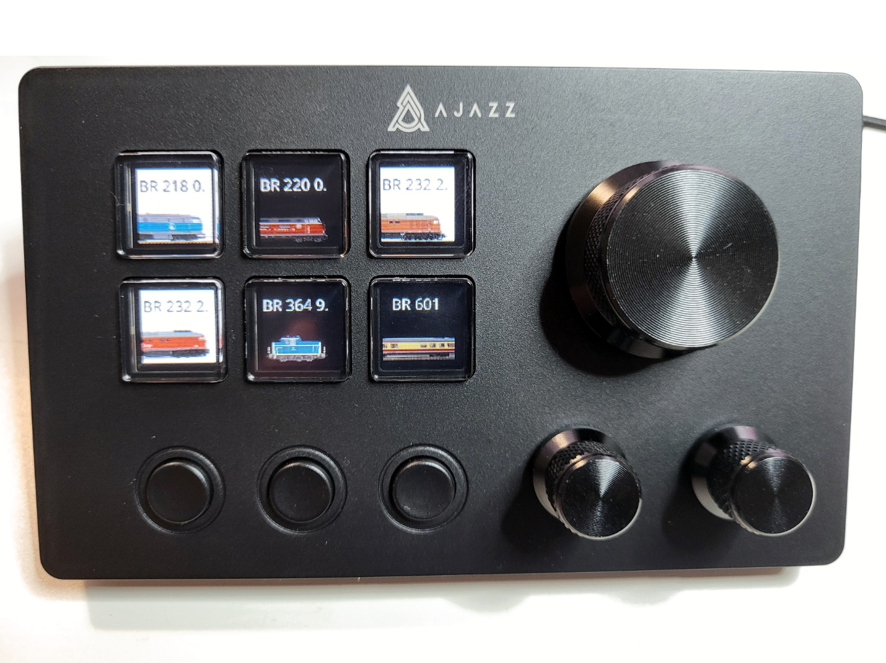
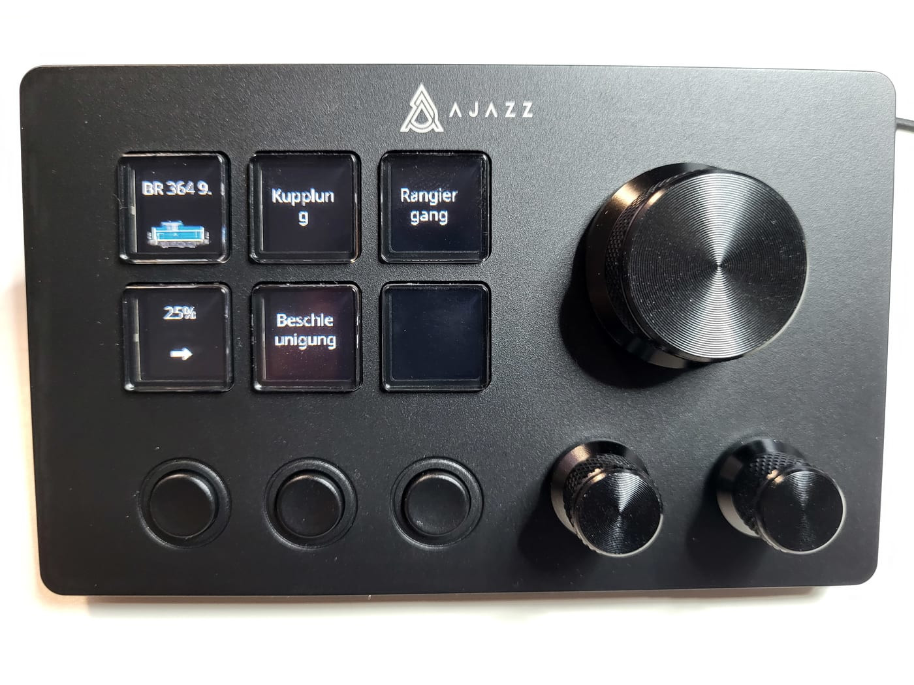
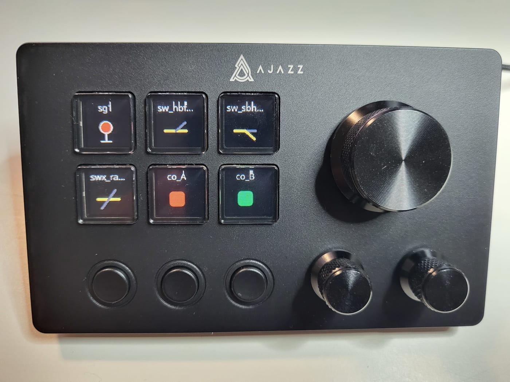
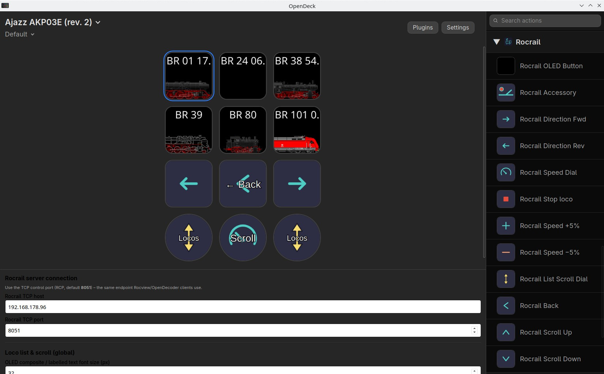

# Rocrail Loco Control – OpenDeck Plugin

OpenAction API plugin for OpenDeck that connects to Rocrail to control model trains using a Stream Deck or any clone supported by OpenDeck.

This is the initial version of the plugin, mainly created with Cursor AI and tested with an Ajazz AKP03E (rev. 2) on Linux.

## Screenshots

**Loco list** — browse the list and pick a locomotive:



**Loco control (throttle)** — control locomotive with streamdeck, speed, light, sound and any other avalibale function:



**Accessory control** — turnouts, signals, sensors, and other plan elements on their own keys:



## Requirements

- [OpenDeck](https://github.com/nekename/OpenDeck)
- [Rocrail](https://wiki.rocrail.net) running with client access (**Client Service**, default port **8051**) and http access (**Rocweb**, default port **8080**)
- Node.js **20 or newer**

## Build

1. Install dependencies:
   ```bash
   cd com.marikar.rocrailcontrol.sdPlugin
   npm install
   ```
2. Create archive
   zip -r com.marikar.rocrailcontrol.streamDeckPlugin com.marikar.rocrailcontrol.sdPlugin

## Installation

1. Build or download `com.marikar.rocrailcontrol.streamDeckPlugin` from github

2. On OpenDeck go to `Plugins` choose `Install from file` and select the built or downloaded file.

3. Restart OpenDeck.

## Global Configuration

Rocrail’s **RCP client/server** channel (TCP control port), **HTTP image service**, scrolling behaviour, default font size on OLED tiles (composite image text and OLED button titles), etc. live in **global plugin settings**.

Global options (Rocrail TCP, HTTP image service, font size, scroll step) are edited from **any** Rocrail Property Inspector instance—**you only need to open the inspector once for those shared fields**; they apply to the whole plugin/profile.


## Button configuration

Multiple devices can be used to control more than one loco at once. For each device a button configuration needs to be set.

For Ajazz AKP03E a recommended configuration is:

- Assign "Rocrail OLED Button" to all 6 OLED buttons. Define a button to show "loco portrait" in "loco control mode (throttle)" , define a button to show "speed & direction". Pressing on this button changes the direction.

- Assign "Rocrail Speed Dial" to dial button. This allows to set speed (turning button) and stop loco (pressing button). In loco list mode it is used to scroll the list. Set scroll mode to "One page per step" if the list of locos is very long.

- Assign "Rocrail Direction Fwd" and "Rocrail Direction Fwd" to a simple button as well as "Rocrail Back" to get back from loco control mode to loco list mode.

- Assign "Rocrail List Scroll Dial" to a dial button to be able to scroll through functions in loco control mode.



## License

Apache License Version 2.0
